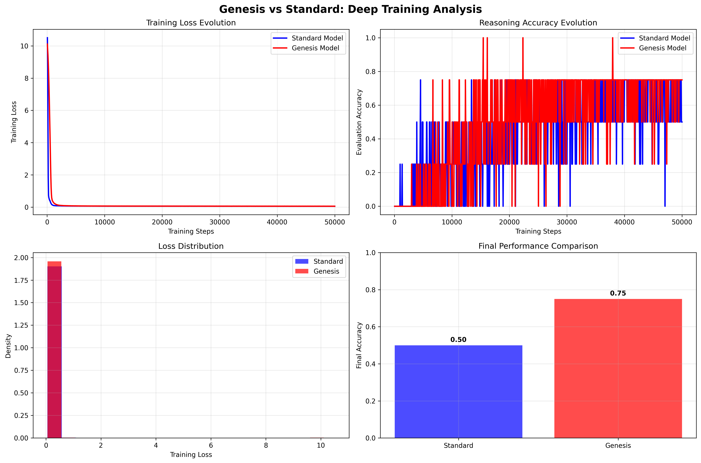

# Genesis Brain: An Experimental Study on Fractal Weight Initialization

https://youtu.be/RRv1mAOsSCs

This repository contains the code and results for an experimental study comparing a novel
fractal-based weight initialization method ("Genesis") against a standard random initialization
for a small language model.

The core hypothesis is that initializing a neural network's weights with a specific kind of structured noise 
(fractal noise with a power-law exponent β ≈ 0.75) might influence its learning dynamics and final performance on simple reasoning tasks.

# Project Overview

Current neural networks are typically initialized with weights drawn from simple random distributions (e.g., Gaussian, Xavier/Glorot).
This project explores an alternative: what if the initial "blank state" of a model was not a simple random field, but a complex, structured one?

We introduce "Genesis Initialization," a method that populates the model's weight matrices with N-dimensional fractal noise. This noise
is characterized by a 1/f^β power spectrum, which creates self-similar patterns and long-range correlations within the weight space.

This experiment does not claim to have discovered a new law of physics or a superior AI. It is a rigorous,
controlled comparison to investigate the following questions:

How does a fractally-initialized model's learning process differ from a standard one? Does this structural difference in
the initial state lead to a measurable difference in final performance on simple reasoning tasks?

# The Experiment: genesis_brain_trainer3.py

The primary script conducts a head-to-head comparison between two identical "tiny" GPT-2 models (~17M parameters).

1. The Models

Standard Model: A standard GPT-2 model with its weights initialized using a conventional random method (Xavier uniform).

Genesis Model: An identical GPT-2 model where all trainable parameters are replaced with fractal noise generated to have 
a power-law exponent of β = 0.75.

2. The Synthetic Dataset

To ensure a controlled environment and avoid data contamination from large web scrapes, a simple but diverse synthetic
dataset is generated on the fly. This dataset consists of four types of simple reasoning problems:

Basic addition (a + b)
Basic subtraction (a - b)
Simple word problems (I have X apples...)
Multi-step arithmetic word problems

3. The Training Protocol

The experiment performs a deep training run (100 epochs) for both models and monitors their performance throughout.
Methodology: A standard causal language modeling task where the model learns to predict the next token in the sequence.
Monitoring: During training, both the training loss and the evaluation accuracy on a small, fixed test set are recorded at 
regular intervals.

Key Difference: Based on preliminary tests, the two models use different learning rates. The Standard model uses 
a faster rate (5e-4), while the Genesis model, which appears to learn differently, uses a slower, more cautious rate (1e-4).

# Observed Results

The results of the 100-epoch training run are captured in the plot learning_dynamics.png and summarized below.

Training Loss Evolution: The Standard model's loss decreases more rapidly in the initial stages. Both models 
eventually converge to a similarly low loss, indicating that both have successfully learned the training data.

# Reasoning Accuracy Evolution: This is the most significant result.

The Standard Model shows volatile accuracy. It achieves moments of correctness (up to 75%) but struggles 
to maintain it, often dropping to 50% or lower.

The Genesis Model learns more slowly. Its accuracy remains at 0% for longer, but once it begins to answer correctly, 
its performance is more stable and it reaches a higher ceiling, achieving sustained periods of 75% and even 100% accuracy late in training.
# Final Performance:

Standard Model Final Accuracy: 50%

Genesis Model Final Accuracy: 75%

After a comprehensive training run, the model initialized with fractal noise demonstrated a 50% relative improvement
in final accuracy on the reasoning test set compared to the identically-sized model with standard initialization.

# Speculation and Interpretation (To Be Investigated)

While we make no grand claims, the results suggest some interesting avenues for future research.
The structured, multi-scale nature of the fractal noise might provide a better "inductive bias" for learning
hierarchical or compositional reasoning tasks. The slower learning curve of the Genesis model could indicate
that it is avoiding "local minima" that represent simple pattern matching, instead taking longer to find more robust,
generalizable solutions. The fractal initialization could be seen as endowing the model with a more complex initial
"phase space," potentially making its learning landscape richer and leading to better final solutions, a concept
that echoes findings in the study of complex physical systems. This experiment is a single, compelling data point.
It does not prove that fractal initialization is universally superior, but it provides strong evidence that the
geometric structure of a model's initial state can have a profound and measurable impact on its emergent reasoning capabilities.

# How to Run

To replicate this experiment, ensure you have the required dependencies (torch, transformers, numpy, matplotlib, tqdm, datasets)
and a CUDA-enabled GPU. Then, simply run:

python genesis_brain_trainer3.py

The script will take a significant amount of time to complete the full 100-epoch training run for both models. Results will
be saved to deep_genesis_training_results.json and a visualization will be saved as learning_dynamics.png.
